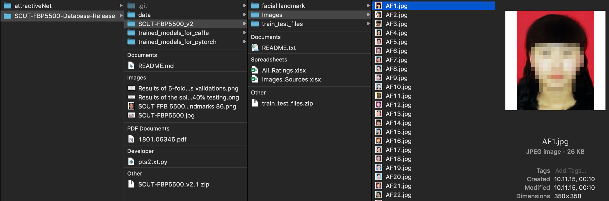
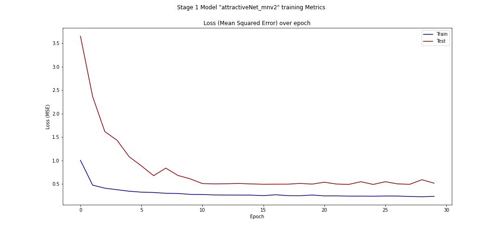

# AttractiveNet
An End-to-End Deep Learning Tutorial in Python.<br>
The Complete code is available on [GitHub](https://github.com/gustavz/attractiveNet) featuring an all-in-one [jupyter notebook](https://github.com/gustavz/attractiveNet/blob/master/train.ipynb).

Learnables covered in this article:
* Download, unzip and store public datasets
* Load and format image and label data
* Split dataset into training, validation and test sets
* Load a keras model with pretrained weights
* Modify a keras model to fit a specific task (e.g. regression, classification)
* Train a keras model in multiple stages and on multiple gpus
* use callbacks to monitor training process
* Plot and interprete training results
* use trained models for live inference
* Run jupyter notebooks on remote machines and access them locally

### Introduction
This article walks through all steps necessary to be able to implement a deep learning project with TensorFlow and Keras. 
As example use-case we are implementing and training a neural network image regressor that predicts an attractiveness score of images of human faces.

> Excursus: Regression predicts a continuous variable (e.g. a price like $2.10) whereas classification predicts a categorical variable (e.g. 0 or 1). Basically, a classification can also be achieved via a regression, if the continuously predicted variable is subsequently divided into distinct ranges (Example: 0.00 - 1.00 -> class 0, 1.01 - 2.00 -> class 1).

The dataset that we are using to train our regressor is the [SCUT-FBP5500](https://arxiv.org/pdf/1801.06345.pdf): A diverse benchmark database (5500 images of shape 350x350, size = 172MB) for multi-paradigm facial beauty prediction, released by Human Computer Intelligent Interaction Lab of South China University of Technology, which is publicly avialble on [GitHub](https://github.com/HCIILAB/SCUT-FBP5500-Database-Release). 

> Opinion: The first thing one notices when looking at the data is that there are no pictures of people of color and moreover a bias of the evaluation regarding the beauty ideal of the asian area cannot be excluded. Therefore, the numeric result of the individual prediction should not be our primary objective, but we should rather focus on the technology enabling it. For this reason I decided not to post pictures of any faces with related attractiveness score. But of course you can do this on your own using what you learn in this article.

The model we are using is `MobileNetV2` which is a convolutional neural network developed by google. The MobileNet model series are known to come very handy in size and are therefore quick in training and inference, while achieving state-of-the art performances. 
Furthermore we are going to modify the model slighty to fit our task.

Finally besides the `tensorflow.keras` library that lifts the main part of our tutorial, this article covers the following usefull libraries that you may not know before but can be helpful in future projects.
```
zipfile36
gdown
glob2
sklearn
matplotlib
alt_model_checkpoint
jupyter
opencv-python
```

To complete the use-case we are having a look on how to run a `jupyter notebook` on a remote server and access it on your local machine via ssh tunneling.

### Step 1: Getting the data

As this is a End-to-End tutorial our first step is to get the data, which means we need to download, unzip and store the images plus labels from the given database url which in this case lays on google drive `https://drive.google.com/uc?id=1w0TorBfTIqbquQVd6k3h_77ypnrvfGwf`. 



As you can see in the screenshot above, the database has its individual format and structure, containing lots of additional stuff we don't need. 

Therefore we are writing a function `download_data()` that not just simply downloads the archive, but uses a function `extract_zipfile()` to filter only the necessary files (image files with `.jpg` suffix  and the label file `All_labels.txt`) and stores them locally in this repository under `data/` while unzipping.

```python
DATA_DIR = 'data/'
LABELS_FILE = 'All_labels.txt'
DATA_URL = 'https://drive.google.com/uc?id=1w0TorBfTIqbquQVd6k3h_77ypnrvfGwf'
ZFILE = 'SCUT-FBP5500_v2.1.zip'

def download_data():
    # Download Dataset
    if os.path.isfile(ZFILE) or os.path.isfile(DATA_DIR+LABELS_FILE):
        print('data already downloaded')
    else:
        print ("data does not exist. downloading it.")
        gdown.download(DATA_URL, ZFILE, quiet=False)
    # Extract ZipFile
    if os.path.isfile(DATA_DIR+LABELS_FILE):
        print("data already extracted.")
    else:
        print("extracting data.")
        if not os.path.exists(DATA_DIR):
            os.mkdir(DATA_DIR)
        extract_zipfile()
        os.remove(ZFILE)

def extract_zipfile():
    with zipfile.ZipFile(ZFILE) as zip_file:
        for member in zip_file.namelist():
            filename = os.path.basename(member)
            # skip directories, all non-jpgs, except labels
            if filename.endswith(".jpg") or filename == LABELS_FILE:
                # copy file (taken from zipfile's extract)
                source = zip_file.open(member)
                target = open(os.path.join(DATA_DIR, filename), "wb")
                with source, target:
                    shutil.copyfileobj(source, target)
```

Furthermore the implementation of `download_data()` ensures that you won't repeat this step over and over again if the files are already available from a previous run. File existance is checked via `os.path.isfile()`.

### Step 2: Load image and label data

After successfully getting the data the next step is to load all images (Input `X`) and labels (Target `y`) as variables into memory as `numpy` arrays as this is the format that machine learning libraries like `tensorflow` and `keras` expect.

> Excursus: An array is a grid of values, all of the same type, and is indexed by a tuple of nonnegative integers. The number of dimensions is the rank of the array; the shape of an array is a tuple of integers giving the size of the array along each dimension.

To achieve this we are writing a function `create_dataset()` that reads all image and label files in our data directory and stores them in the variables `X` and `y`.

```python
def create_dataset(target_size):
    X = []
    y = []
    labels_dict = get_labels_dict()
    img_files = glob.glob(DATA_DIR+'*.jpg') # glob library to get all files in path as list
    print(f'reading {len(img_files)} images into dataset')
    for f in img_files:
        img = preprocess_image(cv2.imread(f), target_size) # open-cv library to read and transform images
        X.append(img)
        y.append(labels_dict[os.path.split(f)[-1]])
    return np.array(X), np.array(y)
```

This function makes use of two more custom functions. Once `get_labels_dict()` which reads all image names and according labels from the text file `All_labels.txt` and returns them in a dictionary object as `key:value` pairs.
The file `All_labels.txt` contains a line for each image in the datasat containing the image file name and the "attractiveness score value" as label in the form of `CF437.jpg 2.883333`.

```python
def get_labels_dict():
    labels_dict = {}
    with open(DATA_DIR + LABELS_FILE) as fp:
        for line in fp:
            # each line looks like: CF437.jpg 2.883333
            img,label = line.split(' ', 1)
            labels_dict[img] = float(label)
    return labels_dict
```
Second it uses a function `preprocess_image()` which does multiple transformations on the raw image to convert it to the desired format using the `open-cv` library.

```python
def preprocess_image(image,target_size):
    return cv2.resize(cv2.cvtColor(image, cv2.COLOR_BGR2RGB),target_size) / .255
```

The transformations include:
* conversion from `BGR` to `RGB` color format
* resizing of the image to the desired target size
* point wise devision of each pixel by 255 (neural networks perform better on normalized data with values between 0 and 1)


### Step 3: Prepare data for training

After loading the input images and labels to the variables `X` and `y`

```python
target_size = (350,350)
X,y = create_dataset(target_size)
```

we are splitting the data into training, validation and test data.
Therefore we use the function `train_test_split()` of the `sklearn` library.

```python
X_train, X_val, y_train, y_val = train_test_split(X, y, test_size=0.30, random_state=42)
X_val, X_test, y_val, y_test = train_test_split(X_val, y_val, test_size=1/3, random_state=42)
```
resulting in following split:  70% Training, 20% Validation and 10% Test data.
Now our data has the following shape:
```python
X_train shape: (3960, 350, 350, 3), y_train shape: (3960,)
X_val shape: (1100, 350, 350, 3), y_val shape: (1100,)
X_test shape: (440, 350, 350, 3), y_test shape: (440,)
```
Furthermore fixing the `random_state` ensures we are always getting the same split results making our project reproducible.

The following step is not necessary but highly usefull if you want to further increase and diversify your training data:
First we create `ImageDataGenerator` objects for training as well for test and validation splits whereas only the training split recieves data augmentation arguments, as validation and test data should never be modified.

> Excursus: Data augmentation is a strategy that enables practitioners to significantly increase the diversity of data available for training models, without actually collecting new data. Data augmentation techniques such as cropping, padding, and horizontal flipping are commonly used to train large neural networks.

The ImageDataGenerator class is part of the `keras.preprocessing.image` modul.

```python
test_val_datagen = ImageDataGenerator()
train_datagen = ImageDataGenerator(horizontal_flip=True,
                                   rotation_range=40,
                                   width_shift_range=0.2,
                                   height_shift_range=0.2,
                                   shear_range=0.2,
                                   zoom_range=0.2)
```
Second we flow the generators by passing the data and desired `batch_size`. 
```python
batch_size = 32

train_generator = train_datagen.flow(X_train, y_train, batch_size=batch_size)
val_generator = test_val_datagen.flow(X_val, y_val, batch_size=batch_size)
test_generator = test_val_datagen.flow(X_test, y_test, batch_size=batch_size, shuffle=False)
```
This marks our last data preparation step as these generators can be passed directly to the keras built-in `model.fit()` and `model.predict()` methods. You may have noticed that the `test_generator` data has not been shuffled, the reason is that we need the test data unchanged as it is to be able to manually calculate the prediction metric in step 7.

### Step 4: Build the model
Building a model with keras is the easiest part of the whole project.
We simply import the model of our choice from the modul `keras.applications`, in our case that's `MobileNetV2`.
When creating the model object we pass the arguments `include_top=False, pooling='avg', weights='imagenet'` which tells keras we are not interested in the model head (we will add our own), we want an average pooling function to be used at the end and as pretrained weights we choose the ones trained on [ImageNet](http://www.image-net.org/).
> Excursus: Imagenet is **the** benchmark computer vision dataset. It contains over 14M images with over 21k annotated classes. Most modern deep learning models build and trained for any computer vision task are initially pre-trained on ImageNet so that the network learns to "understand" image data.

The weights are downloaded once when we create the `basemodel` the first time, in every following call they are loaded from your local storage.

```python
basemodel = MobileNetV2(include_top=False, pooling='avg', weights='imagenet')
```
Next we create a Sequential model which is the easiest way of creating a model in keras, append our basemodel and add a fully connected layer `Dense()` with a single output at the top (our new head of the network).
You can imagine a Sequential model as a model where you can just stack model components on top of each other that are added sequentially / layer wise.
The single dense / fully connected layer at the top of our model results in one single continous output variable, which is exactly what we want in a regression task.

```python
model = Sequential()
model.add(basemodel)
model.add(Dense(1))
```

### Step 5: Multi Stage Training

We are training the model in two stages. First we only train the custom model head, which is the single fully connected layer.
After this layer is trained until conversion we re-train the whole model (including the weights of MobileNetV2 which are pre-trained on ImageNet) with a reduced learning rate.

#### Stage 1:
First we define our training parameters learningin rate `lr` to be 0.001 and training for 30 `epochs`
```python
epochs = 30
lr=0.001
```
Then we set the first layer of our model (which is the `basemodel` `MobileNetV2`) to be not trainable.
After that we compile our model to use Mean Squared Error (MSE) as loss function and `Adam` as optimizer, passing our learning rate.
```python
model.layers[0].trainable = False
model.compile(loss='mean_squared_error', optimizer=Adam(learning_rate=lr))
```
Calling `model.summary()` shows us detailed information about our model. As you can see it consists of two layers and in this stage has only 1281 trainable paramters which are the ones of the final dense (or fully connected) layer. So this confirms that everything is how we want it and we can proceed.
```python
Model: "attractiveNet_mnv2"
_________________________________________________________________
Layer (type)                 Output Shape              Param #   
=================================================================
mobilenetv2_1.00_224 (Model) (None, 1280)              2257984   
_________________________________________________________________
dense (Dense)                (None, 1)                 1281      
=================================================================
Total params: 2,259,265
Trainable params: 1,281
Non-trainable params: 2,257,984
```
If we are training our model on multiple GPUs we need to create and compile a second mulit-gpu model.
In this case we are creating a gpu model that runs on 4 GPUs (modify this to your needs) by passing the normal model as argument.
```python
parallel_model = multi_gpu_model(model, gpus=4)
parallel_model.compile(loss='mean_squared_error', optimizer=Adam(learning_rate=lr))
```
Next we define our callbacks that we will pass to the `model.fit()` method in the actual training call.
Here it is important to note that we are not passing the default keras `ModelCheckpoint` class, but instead the `AltModelCheckpoint` which we import from the `alt_model_checkpoint.tensorflow` modul. This allows us to safe checkpoints of our normal model, while training the gpu model.
Furthermore we add `EarlyStopping`, as we want only the best model at the earliest point in training.
```python
callbacks = [
    EarlyStopping(
        monitor='val_loss',
        min_delta=1e-3,
        patience=7,
        verbose=1,
        ),
    AltModelCheckpoint(
        model_path,
        model,
        monitor='val_loss', 
        verbose=1, 
        save_best_only=True, 
        save_weights_only=False, 
        )]
```
Finally we call train our model with the `model.fit()` method, passing all our predefined arguments including train and validation data generators
```python
history1 = parallel_model.fit(
    train_generator,
    epochs=epochs,
    steps_per_epoch=len(y_train) // batch_size,
    validation_data=val_generator,
    verbose=1,
    callbacks = callbacks)
```
the history object we are getting back from the training call includes all training metrics which we are using to visualize our training results in step 6.

#### Stage 2:
We are basically doing the same as in Stage 1, with the diffefence that we decrease the learning rate by a factor of ten and make the whole model trainable.
So we re-use the complete code from stage 1, but modify those two lines:
```python
lr=0.0001
model.trainable = True
```

### Step 6: Visualize Training Results

To visualize the training results (after each stage) we write a function `plot_metrics()` that plots both the training loss and the validation loss over time. Both losses are included in the history object which is returned from a finished `model.fit()` training run. For this purpose we use use the modul `pyplot` of the `matplotlib` library.

```python
DOCS_DIR = 'docs/'
def plot_metrics(history, model_name, stage):
    f,(ax1) = plt.subplots(1, 1, figsize=(15,7))
    f.suptitle(f'Stage {stage} Model "{model_name}" training Metrics')
    ax1.plot(history.history["loss"], color='darkblue', label="Train")
    ax1.plot(history.history["val_loss"], color='darkred', label="Test")
    ax1.set_title('Loss (Mean Squared Error) over epoch')
    ax1.set_xlabel('Epoch')
    ax1.set_ylabel('Loss (MSE)')
    ax1.legend()
    plt.show()
    plt.savefig(f'{DOCS_DIR}metrics_stage_{stage}_{model_name}')
```
which produces plots that look like the following and are furthermore saved locally under `docs/` folder.


### Step 7: Testing
To test a desired model we first load it from file and then call `model.predict()` on it, passing the previously created `test_generator` object containing the test data which our model did not see yet during the training process.
```python 
model = load_model(model_path)
prediction = model.predict_generator(test_generator)
```
When the prediction of the complete test dataset is finished we calculate the metrics Root Mean Squared Error (RMSE) and Mean Absolute Error (MAE) which are the most meaningfull and therefor the most often used metrics for regression tasks.
> Excursus: Which Metric fits which ML Task

Both `RMSE` and `MAE` are implemented in the `metrics` modul of `sklearn`.
```python
RMSE = mean_squared_error(y_test, prediction, squared=False)
MAE = mean_absolute_error(y_test, prediction)
```
The model that was trained using the [notebook]() to this article and which is also included to the github repository achieves
```python
RMSE: 0.28585716016204066
MAE: 0.21198338088908802
```
which is even slightly better than the results achieved by the original database authors with other models like `AlexNet', `ResNet-18` and `ResNeXt-50`.


### Step 8: Live Inference
To write a quick live inference script using our webcam as input we first need to load our model
```python
model_path = 'models/attractiveNet_mnv2.h5'
model = load_model(model_path)
```
Then we use `OpenCV` to capture our video frame (`0` means our built-in webcam as input, but you can pass any video file or source).
```python
cap = cv2.VideoCapture(0)
```
After that we start an infinite loop capturing video frames, feeding them to the model and visualizing the result on the displayed stream.
```python
while(True):
    ret, frame = cap.read()
    score = model.predict(np.expand_dims(helper.preprocess_image(frame,(350,350)), axis=0))
    text1 = f'AttractiveNet Score: {str(round(score[0][0],1))}'
    text2 = "press 'Q' to exit"
    cv2.putText(frame,text1, (10,50), cv2.FONT_HERSHEY_SIMPLEX, 1, (255,255,0), 2, cv2.LINE_AA)
    cv2.putText(frame,text2, (10,100), cv2.FONT_HERSHEY_SIMPLEX, 1, (255,255,0), 2, cv2.LINE_AA)
    cv2.imshow('AttractiveNet',frame)
```
Still in the loop we add a break condition for hitting the `Q` key.
```python
    if cv2.waitKey(1) & 0xFF == ord('q'):
        break
```
Finally after the loop we release the video capture and destroy all opencv windows.
```python
cap.release()
cv2.destroyAllWindows()
```

### Add-On: Running jupyter notebooks on remote servers
As a lot of us do not have powerfull gpu machines at home it often makes sense to run a jupyter notebook executing the training job on a remote server hosted from cloud service providers like [AWS](https://aws.amazon.com/de/ec2/).

Launch a jupyter notebook on the server with the following command:
```
jupyter notebook --no-browser --port=XXXX --ip 0.0.0.0
```
and then connect to that server via `ssh` tunneling on your local machine.
```
ssh -N -f -L localhost:YYYY:remotehost:XXXX remoteuser@remotehost
```
`XXXX` represents the port where the notebook is running on server side and `YYYY` represents the port on your local machine. 
You could set both to 8888, which is the default port for jupyter applications.

`remotehost` and `remoteuser` represent the credential you are using to log into the server.

Finally open a new browser tab with `localhost:YYYY` where jupyter will prompt you to input a session token. 
This token can be found in the console/terminal under the `jupyter` command you executed on the server.
If you closed that console already you can check for running notebooks with `jupyter notebook list`

### Final Words

No final words. Just get on GitHub, clone this [repository](https://github.com/gustavz/attractiveNet) and get started yourself.

I hope you enjoyed it.